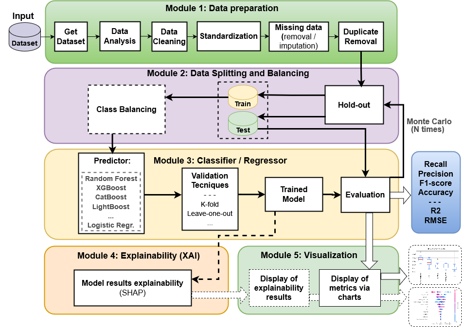

# AutoBioLearn

### A Framework for Automated Machine Learning and Explainable AI in Biological Data Analysis

---

## Project Description

AutoBioLearn is an automated framework designed to streamline machine learning (ML) and explainable AI (XAI) processes, specifically for biological and health data analysis. It assists data scientists and health researchers by automating data preprocessing, model selection, hyperparameter tuning, evaluation, and interpretability, allowing for robust, efficient, and reproducible analyses without extensive programming knowledge.

---

## Visual Demo (Optional)



---

## Features

- **Automated ML Pipelines**: Automates data preprocessing, model training, evaluation, and visualization, minimizing human intervention.
- **Support for Classification and Regression Models**: Includes popular models such as SVM, Random Forest, XGBoost, CatBoost, LightGBM, and Logistic Regression.
- **Cross-Validation and Hyperparameter Tuning**: Offers cross-validation and systematic hyperparameter tuning for optimal performance.
- **Explainable AI (XAI)**: Uses SHAP (Shapley Additive Explanations) to provide both global and local interpretability for model predictions.
- **Comprehensive Visualization**: Generates visual outputs, such as boxplots and SHAP plots, to aid in model comparison and interpretability.

---

## Installation

To get started with AutoBioLearn, follow these steps:

1. **Clone the repository**:
   ```bash
   git clone https://github.com/badaroz/AutoBioLearn.git
   cd AutoBioLearn
   ```

2. **Set up the environment** (recommended):
   - Using `virtualenv`:
     ```bash
     virtualenv venv
     source venv/bin/activate
     ```
   - Or, using `conda`:
     ```bash
     conda create -n autobiolearn_env python=3.10
     conda activate autobiolearn_env
     ```

3. **Install dependencies**:
   ```bash
   pip install -r requirements.txt
   ```

---

## Prerequisites

- **Python**: Version 3.10.14 or higher
- **Libraries**: Pandas, Scikit-Learn, NumPy, SHAP, Matplotlib (list other dependencies based on the `requirements.txt` file)

---

## Usage

Here’s a basic example of how to use AutoBioLearn for a classification task:

1. **Load and Preprocess Data**:
   ```python   
   from AutoBioLearnClassification import AutoBioLearnClassification
   from data_treatement import DataProcessor, DatasetByFile
   pipeline = AutoBioLearnClassification()

   # Initialize the framework with your dataset
   dataset= DatasetByFile(file_path="path_to_your_dataset.csv",target="target_variable",delimiter=',')
   data_processor = DataProcessor(dataset)
   pipeline.get_dataset(data_processor= data_processor)
   ```

2. **Run the ML Pipeline**:
   ```python
   pipeline.execute_models(models=['xgboost','catboost'])
   ```

3. **Visualize Results**:
   ```python
   pipeline.plot_metrics(metrics=['F1-score', 'ROC-AUC'])
   ```

AutoBioLearn also supports additional configuration options, including specifying hyperparameters, model selection, and visualizing SHAP explanations. 

---

## Application Example

In a sample application, AutoBioLearn was applied to a synthetic health dataset for predicting patient outcomes based on various health indicators. Using automated tuning and cross-validation, AutoBioLearn identified optimal models and provided SHAP-based interpretability, revealing key features influencing predictions, such as age, treatment type, and biomarker levels.

---

## Complete Documentation

For more details on each module and advanced configuration options, refer to the [AutoBioLearn Documentation](link_to_full_docs_if_available).

---

## Project Structure

- **src/**: Contains the main framework code and modules.
- **examples/**: Provides example scripts demonstrating basic and advanced uses of AutoBioLearn.
- **tests/**: Includes unit tests for testing individual functions and modules.
- **docs/**: Documentation files (if using Sphinx or other documentation generators).

---

## Contributing

We welcome contributions to AutoBioLearn! To contribute:

1. Fork the repository and create your branch:
   ```bash
   git checkout -b feature/YourFeature
   ```

2. Make your changes and run tests to ensure compatibility.
3. Submit a pull request with a detailed description of your changes.

Please review our [Code of Conduct](link_to_code_of_conduct) before contributing.

---

## License

This project is licensed under the MIT License - see the [LICENSE](LICENSE) file for details.

---

## Authors and Acknowledgments

- **Primary Author**: [Lucas Pinheiro Badaró Moreira](https://github.com/badaroz) - Contact for primary development and design.
- **Contributors**: [Sérgio Nery Simões](https://github.com/badaroz)
- **Acknowledgments**: Special thanks to collaborating institutions and funding bodies that supported this work.

---

## References

1. MacEachern et al. (2021). "Machine Learning Applications in Healthcare."
2. Ahmed et al. (2020). "Artificial Intelligence in Medicine: A Comprehensive Review."
3. Milton Gama et al. (2021). "XAI in Healthcare Data Analysis."

